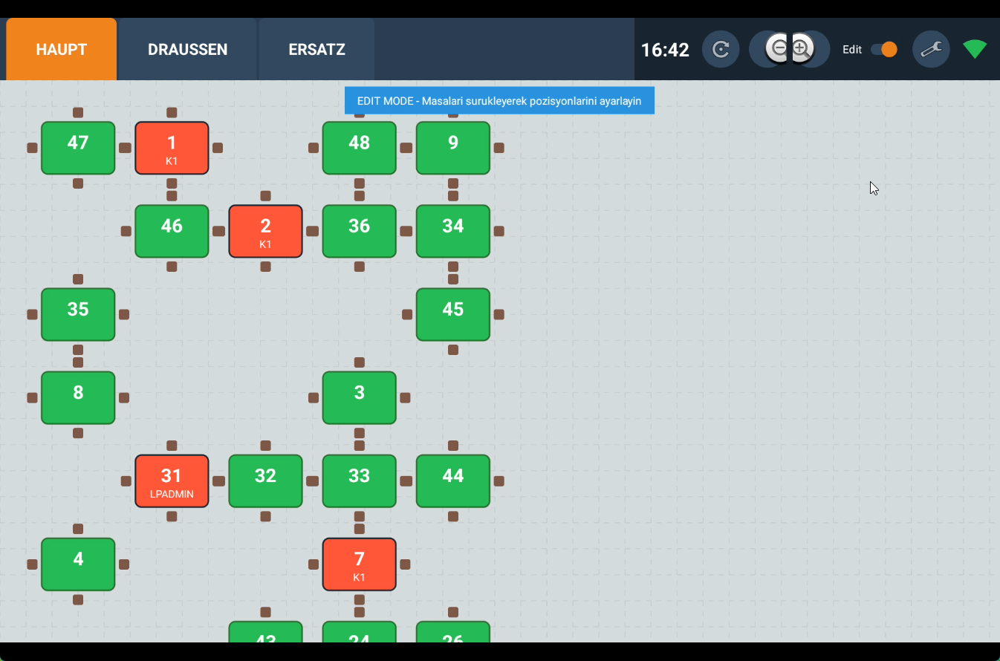
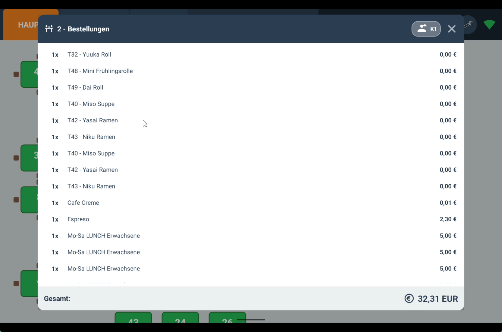
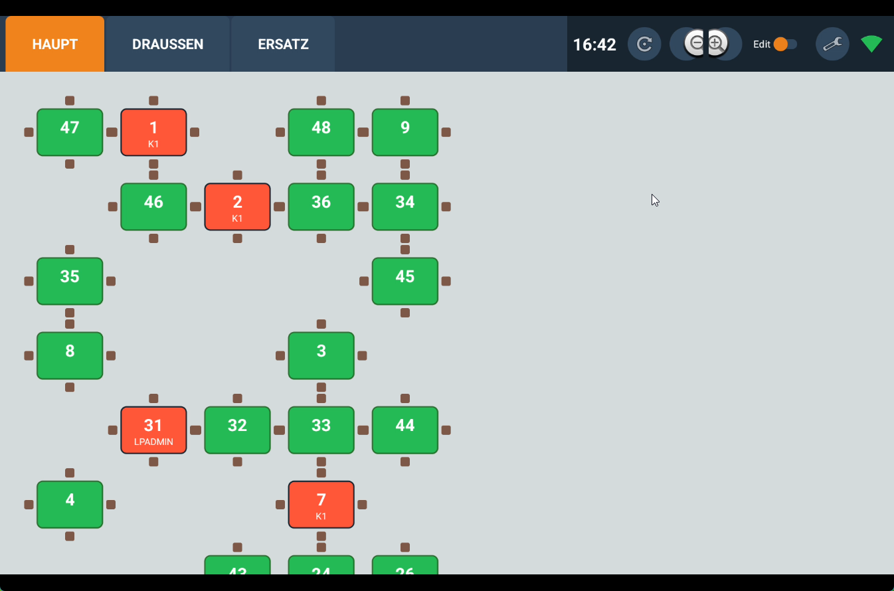
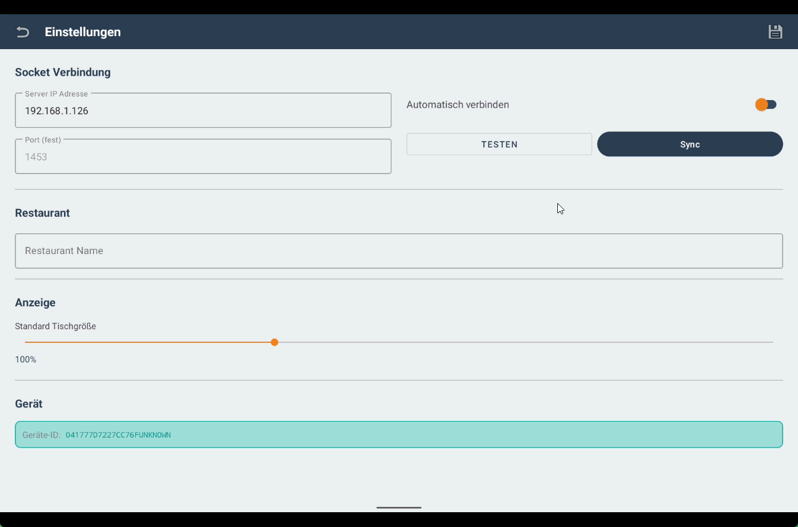

# LP Table Look

Eine Android-Anwendung zur Visualisierung und Verwaltung von Restauranttischen. Die App kommuniziert mit einem Backend-Server über WiFi, um Tischdaten und Bestellinformationen zu synchronisieren.

## Funktionen

### Tischverwaltung
- **Visuelle Tischansicht**: Interaktive Darstellung aller Tische mit Farbcodierung nach Status
  - Grün: Frei
  - Rot: Besetzt
  - Orange/Blau: Verschiedene Belegungszustände
- **Plattform-Tabs**: Verschiedene Bereiche (z.B. Hauptraum, Terrasse, VIP) als separate Tabs
- **Bearbeitungsmodus**: Tische per Drag & Drop neu positionieren
  - Aktivierung über den Edit-Schalter in der oberen Leiste
  - Gepunktetes Raster zur besseren Ausrichtung
  - Tische können durch Ziehen verschoben werden
  - Automatisches Einrasten am Raster (Grid-Snapping)
  - Ausgewählter Tisch wird mit farbigem Rahmen hervorgehoben
  - Positionen werden automatisch in der Datenbank gespeichert
  - Banner-Hinweis zeigt aktiven Bearbeitungsmodus an
- **Skalierung**: Zoom-Funktion für die Tischansicht

### Bestellungen
- **Bestellübersicht**: Popup-Dialog mit allen Bestellungen eines Tisches
- **Garsonanzeige**: Kellnername wird mit Icon im Dialog-Header angezeigt
- **Gesamtsumme**: Automatische Berechnung der Tischsumme
- **Verbindungsprüfung**: Automatische Prüfung der Kassenverbindung vor dem Laden

### Verbindung
- **WiFi-Status**: Echtzeit-Anzeige der WiFi-Signalstärke
- **Socket-Kommunikation**: TCP-Verbindung zum Kassensystem (Port 1453)
- **Geräteregistrierung**: Automatische Registrierung beim Server

### Einstellungen
- **Server-Konfiguration**: IP-Adresse des Kassenservers
- **Verbindungstest**: Überprüfung der Serververbindung
- **Datensynchronisation**: Manueller Sync von Plattformen und Tischen
- **Tischgröße**: Einstellbare Standard-Skalierung

## Technische Details

### Architektur
- **MVVM-Pattern** mit Repository-Layer
- **Room Database** für lokale Datenspeicherung
- **Kotlin Coroutines** für asynchrone Operationen
- **Custom Views** für die Tischvisualisierung

### Abhängigkeiten
- AndroidX Core KTX
- Room Database
- Material Design Components
- Kotlin Coroutines
- LeakCanary (Debug)

### Mindestanforderungen
- Android 11 (API 30) oder höher
- WiFi-Verbindung zum Kassensystem
- Tablet-optimiert (Landscape-Modus unterstützt)

## Projektstruktur

```
app/src/main/java/com/lotus/lptablelook/
├── data/                   # Datenbank-Layer
│   ├── AppDatabase.kt
│   ├── TableRepository.kt
│   └── *Dao.kt
├── model/                  # Datenmodelle
│   ├── Table.kt
│   ├── Platform.kt
│   ├── OrderItem.kt
│   └── Settings.kt
├── network/                # Netzwerk-Kommunikation
│   ├── SyncService.kt
│   ├── SocketService.kt
│   └── NetworkUtils.kt
├── ui/                     # UI-Komponenten
│   ├── TableOrdersDialog.kt
│   ├── OrderAdapter.kt
│   └── ProgressDialog.kt
├── view/                   # Custom Views
│   └── TableFloorView.kt
├── MainActivity.kt
└── SettingsActivity.kt
```

## Installation

1. Repository klonen
2. In Android Studio öffnen
3. Gradle-Sync ausführen
4. Auf Gerät oder Emulator installieren

## Konfiguration

1. App starten
2. Einstellungen öffnen (Zahnrad-Icon)
3. Server-IP eingeben
4. "Testen" klicken zur Verbindungsprüfung
5. "Sync" klicken zum Laden der Tischdaten

## Server-Kommunikation

Die App verwendet folgende Befehle:

| Befehl | Beschreibung |
|--------|--------------|
| 01 | Geräteregistrierung |
| 02 | Plattformen abrufen |
| 27 | Tischsumme abrufen |
| 28 | Tischstatus abrufen |
| 32 | Bestellungen abrufen |
| 39 | Alle Tische abrufen |

## Screenshots

### Tischübersicht


### Bestellungen Dialog


### Einstellungen


### Verbindungsstatus


## Lizenz

Dieses Projekt ist unter der [GNU General Public License v3.0](LICENSE) lizenziert.

Sie können diese Software frei verwenden, modifizieren und verbreiten, solange alle abgeleiteten Werke ebenfalls unter der GPL-3.0 lizenziert werden.

## Autor

Erkan Kaplan
